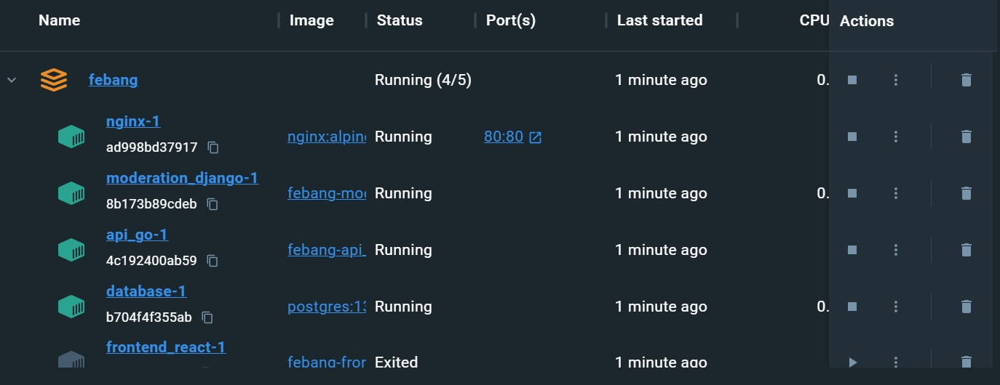

# Febang
Febang это настольная браузерная игра на основе настолькой игры Bang
## Требуемые программы
[Docker](https://docs.docker.com/engine/install/) и дополнение [Docker Compose](https://docs.docker.com/compose/install/linux/)
## Запуск проекта
Все команды нужно запускать в терминале в корневой папке проекта и при запущенном Docker Desktop
### Сборка
```bash
docker compose build
```
### Запуск собранного проекта
```bash
docker compose up -d
```
### Перезапуск проекта
```bash
docker compose restart
```
### Остановка запущенного проекта
```bash
docker compose stop
```
## Использование проекта
Проект содержит 3 векти, а именно:
1. Основной [сайт](http://localhost) (http://localhost)
2. Сайт [модерации](http://localhost/moderation/) (http://localhost/moderation/)
3. [АПИ](http://localhost/api/doc/) (http://localhost/api/doc/)


Так выглядит запущенный сервер

<a href="https://vk.com/kologermit/"></a><a href="https://t.me/kologermit/"></a><a href="https://github.com/kologermit/"></a>